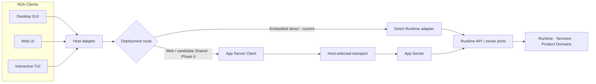
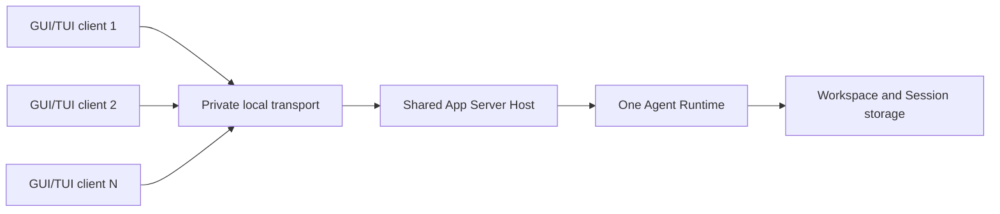

# App Server 架构设计

> 状态：Embedded interactive TUI direct-runtime 已交付；Shared App Server 仍是待评审提案。
>
> 基线日期：2026-08-13。
>
> 本文记录 Embedded direct-runtime 决策，以及需要连接边界时的 App Server 约束和 Shared transport 提案。具体 TUI 迁移阶段、接口盘点和当前缺口见
> [`tui-app-server-decoupling-refactor-plan.md`](../plans/tui-app-server-decoupling-refactor-plan.md)；Agent Runtime 的进程、所有权和实例隔离见
> [`agent-runtime-deployment-design.md`](agent-runtime-deployment-design.md)；产品 owner 与分层依赖见
> [`product-architecture.md`](product-architecture.md)。Embedded TUI 当前调用路径以 direct-runtime composition 为准；Shared transport 未通过独立评审前继续使用 v17。

## 1. Decision and remaining proposal

本次重构采用候选 B/C 的受限组合：**Embedded deployment 直接调用同进程
Agent Runtime 的 typed API；需要进程间或网络边界的 Rich Client 才使用 App
Server**。因此，Rich Client 这一产品分类不再意味着所有部署都必须经过同一
wire。

- Embedded Host 直接持有产品组装得到的 `AgentRuntime` 和必要的 owner/service，
  通过 Rust 类型调用 Runtime 方法；不创建 `OpenBitFunAppServer`、
  `AppServerClient` 或 in-memory transport。
- Embedded TUI 仍只依赖 app-local composition。TUI controller 不直接依赖
  Runtime 实现或私有 IPC operation；`CliAgentRuntimeClient` 承载
  Embedded/Shared 的共同 Runtime 行为，并在内部选择 direct typed API 或 private IPC。
- Model、Skill、Subagent、MCP、Account、Settings Sync、Worktree、External Source 和
  Hook 等管理面不进入 `CliAgentRuntimeClient`。TUI controller 直接调用对应
  owner/service 的稳定 API，并在使用 controller-local owner 前拒绝 Remote workspace scope。
  App Server 在自己的 crate 中独立维护 domain-to-wire adapter；
  TUI 不复用其 implementation，也不以 App Server 兼容性作为重构验收条件。
- Web UI / WebSocket Host 继续使用 App Server，因为它们需要连接、transport、
  认证、作用域和事件转发边界。
- Shared TUI 继续使用 private Runtime IPC v17，直到 Shared App Server 通过
  独立的鉴权、controller/lease、恢复、取消、背压、限制、性能和回滚门槛；本次
  Embedded 重构不自动替换或删除 v17。
- Headless CLI/CI、ACP、Peer Host 和公开 Agent SDK 继续使用各自经评审的
  adapter，不因 Rich Client 的 App Server 合同被强制改用 App Server。
- App Server 仍是协议适配层，不接管 Agent Runtime、Service 或 Product Domain
  的业务所有权。直接 Runtime adapter 也只能调用既有 owner，不得复制业务状态。

Embedded 直调不是绕过安全或行为合同。它省略的是进程内无意义的 wire 和连接治理，
仍必须传递明确的 workspace、execution domain、权限和 request context，并复用同一
Runtime owner、错误语义、事件语义和持久化规则。

### 1.1 Decision rationale and remaining alternatives

| 候选 | 结构 | 收益 | 成本与风险 | 采用门槛 |
| --- | --- | --- | --- | --- |
| A. App Server-first Rich Clients | Desktop、Web、Embedded/Shared TUI 复用一个 wire 与 typed client | 跨 Rich Client 合同和 fixture 最集中 | Embedded 编解码与 runtime/thread 成本；Shared 必须重新交付连接治理 | 仅适用于确实需要进程/网络边界的 Host；不再作为 Embedded 默认方案 |
| B. Deployment-specific product adapters（Embedded 采用） | Embedded 直接调用 Runtime API；Web/Remote/Shared 按部署选择 transport adapter，共享 owner ports | 消除同进程编解码和 server task，保持 Host 生命周期简单 | DTO、错误、恢复和行为 fixture 可能分叉；需要统一行为合同 | Direct adapter 无 owner 复制，且通过跨入口行为等价测试 |
| C. Shared Runtime use cases with separate wires（保留） | 提取稳定用例/结果，Embedded 使用 Rust adapter，Shared 保留 v17 或后继 wire，Web 使用 App Server | 业务语义集中，同时允许 deployment-specific framing、安全和性能 | 需要清晰区分 use-case DTO 与 wire DTO；client 不能假装同一协议 | Shared transport 只有通过独立门槛后才可替换 v17 |

Embedded 已选择 B/C 的受限组合，A 不再是 Embedded 默认方案。Shared 仍可选择经门槛验证的 App Server transport，或把 private v17/后继协议保留为部署专用 wire；已有 DTO 或 adapter 不能替代该评审。

### 1.2 Costs of the preferred candidate

- Embedded direct adapter 需要维护 Runtime typed API 与 TUI-facing contract 的映射；必须以行为 fixture 证明它没有复制 Session、Permission、Config 或 capability 状态。
- 旧 Embedded App Server 仅保留为迁移历史基线；Phase 5 已切换到 direct-runtime 并删除旧路径，不保留回滚 adapter，也不能在 direct adapter 返回 unsupported 后静默回退。
- Shared App Server 需要重新交付 v17 已有的 framing、方向性 limits、鉴权、实例身份、controller/lease、断连取消、未知结果和空闲退出，不能只复用 method/DTO。
- Desktop 迁移必须划清 controller-local capability、Tauri 生命周期和工作区 Host capability；Web/Remote 扩展还需要独立的认证、授权和多租户资源治理。

### 1.3 当前实现状态

目标架构与已交付能力必须分开描述：

| 范围 | 当前状态 | 目标 |
| --- | --- | --- |
| Embedded TUI | 已使用 `CliAgentRuntimeClient` 通过 Rust Runtime SDK typed facade 调用同进程 `AgentRuntime`；其他能力由 controller 直接调用已有 owner/service API | 保持 direct-runtime 为 Embedded 默认，不恢复 App Server client/server、in-memory transport、wire handshake、catch-all TUI client、surface service 或统一 TUI management 模块 |
| Shared TUI | 仍通过私有 Runtime IPC v17 连接独立 Runtime Host | 保留 v17；是否迁入 Shared App Server 由可靠性、安全、性能和回滚证据决定 |
| Desktop GUI | 主要仍使用 Tauri command 和桌面事件投影 | Embedded 时使用 direct Runtime adapter；需要连接边界时使用 App Server，Tauri 保留平台能力 |
| Web Host | 当前 Server 已组装 Embedded Runtime，WebSocket 直接承载 `BitfunAppServer`；仅适用于 loopback 单用户模式 | 补齐连接身份、作用域绑定和 Host allowlist 后才能扩展部署范围 |
| CLI stdio Server Host | `bitfun server` 命令在 `src/apps/cli/src/server_host.rs` 独立装配 stdio `BitfunAppServer`；该装配点是 CLI 唯一允许依赖 App Server implementation 的位置。Host 注入 canonical cwd workspace scope、显式 method allowlist、transport limits 与 stdin EOF disconnect 信号 | 保持独立 Host 表面：stdout 只承载 JSON-RPC line 流量，frame 超限 fail closed，断连后取消在途 Turn 并确定性退出；TUI/controller/Headless CLI 不依赖 App Server |
| App Server protocol/client | 已拆为 behavior-light crate，已有版本、能力、限制、错误和部分事件恢复类型 | 补齐 Host 注入能力、可靠性语义及跨 transport 合同测试 |
| App Server server | 已注册 app、agent、session、permission、TUI/workspace、git、config 和 i18n handler | 按真实 owner 和 Host 装配收窄能力，不以已存在 DTO 代替可用性证据 |

Shared TUI 继续使用 Runtime IPC 是当前 compatibility boundary。Embedded direct-runtime
迁移不改变该边界。只有 Shared App Server 通过替换门槛后，才评审迁移或删除 v17；候选
B/C 允许将 private v17 或后继协议保留为受控的长期物理 wire。

### 1.4 Migration and replacement gates

Embedded direct-runtime 的 Phase 5 验收合同如下；当前实现持续受这些合同约束：

| 门槛 | 必需证据 |
| --- | --- |
| Typed facade 与 owner | direct adapter 只调用稳定 Runtime/owner-provider facade；不暴露内部类型，不复制 Session、Permission、Config、capability 或事件状态 |
| 上下文与能力 | workspace、execution domain、permission、remote facts 和 capability 来自真实 Host/Runtime 组装；不从 UI 猜测，不静默本机回退 |
| 行为与事件 | 请求结果、事件顺序、pending Permission、取消、`unsupported`、lag/closed 和 `outcome_unknown` 与既有行为合同等价 |
| 生命周期与性能 | 不创建 App Server client/server、in-memory transport 或额外 Runtime；订阅和任务可回收，并记录启动、延迟和内存对比 |
| 迁移与删除 | 同一 TUI fixture 覆盖 direct 与旧 App Server；升级/降级读取兼容，旧路径仅作为迁移基线并在切换后删除 |

Shared App Server 只有满足以下连接治理门槛后才可替换 v17：

| 门槛 | 必需证据 |
| --- | --- |
| Framing 与 limits | request/response/event/attachment 的方向性上限、无界分配防护、慢 client/backpressure 和超限结果均有跨 transport 测试 |
| 身份与作用域 | 实例身份、每连接认证、user/product/workspace/execution-domain 绑定和 method allowlist fail closed |
| Controller 与 Session 单写 | controller/observer/lease、断连隔离、跨进程 Session writer 冲突和转移规则有 owner-level 决策与竞争测试 |
| 事件恢复 | 明确 snapshot/replay owner、连接内 cursor、跨连接是否持久化、lag/closed/invalidation 和 resync 行为 |
| 取消与未知结果 | disconnect/shutdown 取消、迟到响应、operation identity、`outcome_unknown` 查询/恢复和禁止盲重试 |
| Host capability | Desktop local effect 与工作区 capability 边界、provider 注入、Remote unsupported 和 Web/Remote auth 已定稿 |
| 生命周期与性能 | discovery、startup、idle exit、crash cleanup、延迟、吞吐和内存有预算与测量 |
| 迁移与回滚 | 同一第一方 consumer 完成 opt-in 双栈 parity；升级/降级和 v17 rollback 可重复验证；删除条件有明确 owner 批准 |

## 2. 问题与目标

GUI、Web 和 TUI 若分别围绕 Tauri command、WebSocket route、CLI/Core 直连维护产品接口，会产生以下问题：

- 同一用例出现多套 DTO、错误码、默认值和字段归一化。
- 某一入口完成权限、取消或远程工作区支持，其他入口仍静默缺失。
- 事件被不同 Host 投影后丢失身份、顺序或恢复信息。
- UI 组件与 Tauri、Core singleton 或私有 Runtime IPC 绑定，无法验证跨入口行为等价。
- “handler 已存在”“DTO 已生成”或“能力被硬编码为 available”被误当成端到端能力已交付。

OpenBitFun 的目标是让 direct adapter 与连接型 App Server adapter 共享可验证的产品后端行为合同，同时保持业务 owner 平台无关。App Server 为需要连接边界的 Host 提供可版本化、可生成 client 的 wire；它不再是 Embedded 的统一 transport，也不统一 GUI/TUI renderer、布局、键位、窗口、终端或 controller-local effect。

## 3. 范围与非目标

本文范围包括：

- Rich Client 的请求、响应、notification、错误、取消和恢复合同。
- Embedded direct adapter、Shared/WebSocket transport 与 Host 生命周期边界。
- Host 能力、transport limit、身份和执行域的协商。
- Desktop/Tauri、Web 和 TUI 的接入规则。
- App Server crate、Runtime owner 和产品装配之间的依赖方向。

本文不负责：

- 迁移 Runtime owner、重写 Session/Turn/Permission/MCP 等业务实现。
- 把 App Server 变成通用 Core RPC、Tool RPC 或任意内部函数调用协议。
- 强制 Headless CLI/CI、ACP、Peer Host 或公开 Agent SDK 使用 App Server。
- 统一 GUI 与 TUI 的状态机、renderer、布局、主题键或键位模型。
- 把 WebSocket transport 宣称为已具备多用户或公网安全性的公开 API。
- 不把缺少维护责任、版本规则和退出条件的临时兼容路径默认为永久协议；若保留 Shared wire，应将其明确定义为正式的部署专用协议。

## 4. 术语

| 名词 | 含义 | 不等于 |
| --- | --- | --- |
| App Server | 将版本化 Rich Client wire 映射到 Runtime API、Service 和 Product Domain owner 的协议适配层；只用于需要该边界的 Host | 业务 owner、通用 RPC 总线、Embedded 的必经路径 |
| App Server Client | 只依赖 wire contract、由 Host 提供 transport 的类型化客户端 | Runtime SDK、Server 构造器、UI 状态 owner |
| Rich Client | 需要持续会话、交互事件和产品管理面的第一方 GUI/Web/TUI | Headless automation、ACP、公开 SDK |
| Host | 组装 direct Runtime adapter 或 App Server、选择 transport、注入能力并管理生命周期的产品入口 | 新业务层、普通用户必须管理的 Server 产品 |
| Embedded direct Runtime | 与 Rich Client Host 同进程、由 `AgentRuntime` typed API 和 owner/provider facade 提供用例的部署方式 | 第二套 Runtime、App Server wire、跨进程后台服务 |
| Embedded App Server | 迁移前 TUI 使用的同进程私有 App Server 实例和 in-memory transport | 当前 Embedded 默认路径、网络 Server、共享后台进程；Phase 5 完成后删除 |
| Shared App Server | 由独立本机 Host 承载、允许多个已认证第一方 client 使用的 App Server 实例 | 公网 API、Agent SDK Host、每个 client 一个 Runtime |
| Runtime owner | 持有 Session、Turn、Permission、Tool/MCP、Hook、事件和持久化事实的既有模块 | App Server handler 或 UI read model |
| Host capability | 当前 Host 确实组装并允许调用的产品能力 | schema 中存在的方法全集 |
| controller-local effect | 剪贴板、外部编辑器、终端 raw mode、窗口和本地导出等只属于控制端的行为 | 工作区或 Runtime 能力 |

## 5. 逻辑架构



依赖和调用方向始终从入口流向 owner。Embedded Host 负责 direct adapter 的 context
构造、能力选择和生命周期；需要连接边界的 Host 负责 transport 认证、连接作用域、
capability/allowlist 和平台能力。App Server handler 负责 method 合同校验、handler
注册、DTO 转换和 Runtime/domain error 到 wire error 的映射。业务一致性、权限上限、
持久化和权威状态仍由对应 owner 提交。

图中的 Web 分支是当前 loopback WebSocket App Server 路径；Shared 分支仅表示 Phase 6
candidate，不是当前或已批准的必经链路。当前 Shared TUI 仍只使用 private Runtime IPC v17，
Web 也不经过 TUI backend composition。

### 5.1 四层合同

| 层 | 负责 | 不负责 |
| --- | --- | --- |
| 行为合同 | 用例语义、状态转移、权限、幂等/重试、错误、事件和恢复条件 | transport framing、UI 展示 |
| Wire 合同 | method、DTO、版本兼容、类型化错误和 notification envelope | Runtime 内部类型、Host 句柄 |
| Host 合同 | transport、可用能力、限制、身份、作用域、生命周期和 controller-local provider | 复制业务规则或权威状态 |
| Owner 合同 | Runtime/Service/Product Domain 的业务事实、校验和提交 | JSON-RPC、Tauri、WebSocket、Ratatui |

行为合同是 Embedded direct-runtime 与 Shared wire 等价的核心；迁移前的 Embedded App Server
仅作为 direct-runtime 切换前的历史基线，不构成迁移后的第三条运行路径。当前
`CliAgentRuntimeClient` 是 Embedded 与 Shared TUI 共用的 Runtime client；CLI-local Host adapters
不是 Shared Runtime wire 的组成部分。行为合同不要求各路径共享 JSON；只要 Runtime client
在断连、超时、事件落后、权限、取消和 unknown outcome 上保持明确且可验证的语义，
即可共享同一 Runtime 用例合同。管理面按各 Host adapter 及其 owner/service 的实际可用性单独验证。

## 6. Phase 5 Embedded interactive TUI（已交付）

本节定义交互式 TUI 已交付的 Phase 5 路径。它不描述 Desktop 或 Web 的迁移完成状态；
Desktop direct Runtime 是独立的已批准迁移步骤，尚未实施。

```text
Embedded interactive TUI
  -> CliAgentRuntimeClient -> AgentRuntime typed API
  -> existing owner/service APIs -> owners/services
  -> Runtime API / owners
```

Embedded Host 必须：

1. 从产品组装结果取得唯一的 `AgentRuntime` 和必要的 owner/service。
2. 通过稳定 Rust Runtime API 构造 typed request，补齐 workspace、execution domain、
   permission 和 remote facts；不得从 UI 或全局环境猜测这些事实。
3. 由 `CliAgentRuntimeClient` 直接消费 `AgentRuntime` 的 typed event/Permission receiver，
    不创建第二个 Core `EventQueue` 订阅或第二份 read model 权威状态。
4. 将 Runtime/domain error 映射为 Runtime port 或对应 owner service 的 TUI error，保留 `unsupported`、取消、
   `outcome_unknown` 等可观察语义。
5. 在 Host 退出时取消并回收由 direct adapter 创建的订阅和任务，并使用与 Shared
   和 Web 路径相同的行为 fixture。

Embedded 可以省略只对跨进程多客户端有意义的机制：endpoint discovery、进程 token、
外部实例锁、多客户端 controller lease、frame 编解码和空闲后台退出。省略这些机制
不能改变请求结果、事件顺序、取消结果、权限边界或 capability 语义。

迁移期间曾以旧 Embedded App Server 建立行为基线；当前生产源码已删除该路径，不保留可选的
rollback adapter，也不得在 direct adapter 返回 unsupported 后静默回退。后续行为、性能和升级
兼容回归以 direct-runtime 与 Shared v17 的 owner-level 合同为准，不恢复第三条 Embedded 路径。

## 7. Shared deployment

当前 Shared deployment 由独立 Runtime Host 通过 private Runtime IPC v17 服务交互式 TUI，不运行 App Server。若后续采用 Shared App Server，则目标拓扑为一个本机 App Server Host 承载一个 Runtime owner，多个第一方 Rich Client 通过受控 Pipe、UDS 或等价私有 transport 连接：



采用 App Server 的 Shared Host 在基础 App Server 合同之外必须提供：

- 安全 endpoint discovery、实例身份和同用户认证材料。
- initialize-first 握手、协议版本和 client identity 校验。
- workspace、用户、产品和 execution domain 绑定。
- 连接数、请求队列、事件队列和 frame 大小上限。
- 每个 Session 的 controller/lease、冲突和转移规则。
- 断连时取消连接拥有的活动操作，并隔离未完成清理的 lease。
- 有序 writer、并发 reader、背压和慢 client 失效策略。
- 无客户端且无活动任务时的受控空闲退出。
- 副作用请求在超时或断连后的 `outcome_unknown` 结果。

当前 Runtime IPC v17 已具有 128 KiB request、8 MiB response/event、token、实例身份、controller/lease、断连取消、有界事件流、`outcome_unknown` 和空闲退出等合同。在 App Server Shared transport 逐项获得等价测试前，该 IPC 可以作为 Shared TUI 的兼容 adapter 保留；不得先切换 transport 再以功能回退换取表面统一。

## 8. Desktop GUI 与 Tauri

Desktop 的调用路径按部署选择：

```text
React UI
  -> frontend infrastructure / generated App Server client
  -> Desktop Host transport adapter
  -> App Server（Web/Shared 或明确需要连接边界时）

Embedded Desktop 的同进程产品请求可以走：

React UI
  -> frontend infrastructure
  -> Desktop direct Runtime adapter
  -> Runtime API / owner ports
```

Tauri 继续拥有窗口、菜单、系统托盘、文件选择器、剪贴板、通知和进程级生命周期。Session、Turn、Workspace、Permission、Config、MCP、Skill、Hook 等产品后端能力必须迁入既有 Runtime/owner；Embedded 时由 direct adapter 调用，需要连接边界时再由 App Server 做协议适配。

迁移规则：

- UI 组件不得直接调用 Tauri API；调用进入前端 infrastructure/adapter。
- Tauri command 若只承载产品后端用例，应由稳定 Runtime typed facade 或需要连接边界时的 App Server method 替代并逐步删除。
- 必须由桌面原生 API 完成的 client-local capability 保留 Host-native 实现；需要与工作区或 Runtime 交互时拆成 direct/App Server 数据流和本地 effect 两段。
- Tauri event bridge 只能投递 direct Runtime/App Server typed notification 或桌面专属事件，不能形成第二套 Runtime 事件语义。
- Desktop Host 可在 direct Embedded 与 Shared/App Server 之间切换，但 UI 不包含部署分支；
  route 选择留在 Host/infrastructure。

## 9. Web、stdio 与远程 Host

CLI 的 `bitfun server` 是同一 App Server 合同的独立 stdio Server Host：stdout 只承载 JSON-RPC line 流量；canonical cwd 是唯一 workspace scope；Host 注入显式 method allowlist；`app/initialize` 返回该 Host 的实际能力与 transport limits；stdin 读取端按 advertised frame limit fail closed；stdin EOF 触发断连生命周期（取消在途 Turn 并确定性退出）。该 Host 是独立 Host surface，不是 TUI/Headless CLI 的默认路径。

WebSocket 是 App Server 的一种 transport，不是另一套业务 API。Web Host 必须使用同一 method、DTO、错误和事件合同，同时根据部署场景构造显式 capability allowlist。

当前 WebSocket Host 只适用于单用户、loopback、受控 Origin 场景。Origin allowlist 和 loopback bind 不能替代以下安全机制：

- 每连接认证和不可伪造的 client identity。
- 用户、workspace、产品和 execution domain 的作用域绑定。
- method/capability allowlist 与 owner 级授权。
- permission context、审计身份和撤销。
- 连接、请求、frame、事件速率和资源配额。

在这些机制交付并验证前，不得把当前 WebSocket Host 暴露到不可信网络、多用户部署或公开 SDK。Remote workspace 的 Runtime、凭据、文件和进程必须位于目标执行域；Host 不得在远端能力缺失时静默回退 controller 本机。

## 10. 能力发现与 transport limits

`app/initialize` 返回的是当前连接实际可用的能力和 transport 限制，不是 protocol crate 中所有 DTO 的静态清单。

能力状态由 Host 根据以下事实构造：

- 产品组装结果和 delivery profile。
- 当前注入的 Runtime/Service/Product Domain provider。
- transport、平台和远程执行域的支持程度。
- 用户、组织和连接级策略。
- provider 健康与当前降级状态。

规则如下：

1. 只有生产 handler、provider、授权和行为测试都存在时，能力才可标记为 `Available`。
2. 不可用能力保留稳定 ID，并返回类型化 `Unavailable { reason }` 或 `unsupported`，不能静默回退旧路径。
3. Host 未注入 provider 时不得因 handler 或 DTO 存在而宣传能力，例如 context reload。
4. transport limits 必须反映当前连接的真实限制；不能把 server 内部默认值宣传为所有 transport 的通用事实。
5. method 级 allowlist 必须是 capability 声明的子集，fallback handler 不能扩大可调用面。

当前实现中通用 App Server 初始化声明 16 MiB frame，而 WebSocket Host 接收上限为 256 KiB，Shared Runtime IPC 又区分 128 KiB request 与 8 MiB response/event。目标合同需要表达方向和 transport 的真实限制；在扩展 schema 前，Host 至少必须返回不超过底层 transport 的有效上限。

## 11. 事件、恢复与取消

需要连接边界的 client 通过其 App Server connection 接收 typed Runtime notification；Embedded direct adapter 则通过 Runtime typed subscription 订阅同一权威 owner。App Server client 不得绕过连接直接订阅 Core `EventQueue`，direct adapter 也不得持有 Core queue receiver 或创建第二个事件 owner；两条路径都不得用有损 frontend projection 替代权威事件流。

每个事件流至少需要：

- 稳定 stream identity。
- 单调 sequence/cursor。
- 与 Session、Turn、request 和 execution domain 的关联身份。
- `closed`、`lagged`、`invalidated` 和 `recoverable` 的明确区分。
- snapshot/sync 或要求重新装载 Session 的恢复指令。

client 落后、frame 超限或连接中断时不能假装事件完整。可恢复流从 server 确认的 cursor/snapshot 继续；不可恢复流进入 invalidated，UI 必须停止基于旧 read model 提交依赖状态的新操作，直到 resync 完成。

取消属于行为合同：

- 每个活动请求和长任务具有稳定 request/operation identity。
- client 取消、Host shutdown 和连接断开映射到对应 owner 的取消路径。
- Shared Host 只取消该连接拥有的操作，不影响其他 controller 的独立任务。
- 取消完成与“取消请求已接收”必须区分；资源和 lease 仅在终态确认后释放。

## 12. 副作用、超时与重试

有副作用的请求必须携带可关联的 request identity，并由合同声明重试语义。若 client 在请求可能已提交后超时或断连，结果必须返回或投影为 `outcome_unknown`：

- `outcome_unknown` 默认 `retryable = false`。
- client 禁止盲目重试 create、submit、permission response、rename、delete 等 mutation。
- client 应先通过 request identity、Session snapshot 或 owner 查询确认结果，再决定恢复动作。
- 纯查询只有在合同声明幂等且不会扩大资源消耗时才可自动重试。

Embedded 虽然较少发生物理断连，也必须保留同一错误类型和 client 处理分支，确保切换 Shared 后不会改变产品行为。

## 13. 安全模型

App Server 是完整产品控制面，安全决策必须绑定到连接和业务作用域，而不是只信任 transport 地址。

| 维度 | 要求 |
| --- | --- |
| 连接身份 | initialize 前完成 transport 级认证；建立不可伪造的 connection/client identity |
| 实例身份 | Shared client 校验 discovery 得到的实例与握手返回一致，拒绝陈旧或替换实例 |
| 业务作用域 | 每个连接绑定 user、product、workspace 和 execution domain；请求不能通过 path 字符串越界 |
| 权限上下文 | permission request/response 关联 client、Session、Turn 和审计主体，Host 不能提高 owner 策略上限 |
| 能力暴露 | Host 使用显式 allowlist；未知方法和未装配能力 fail closed |
| 资源治理 | 连接、请求、frame、队列、并发、速率和任务生命周期有界 |
| 远程边界 | 凭据、文件、进程和 Runtime 留在目标执行域；禁止本地 fallback |

Embedded direct invocation 可以依赖同进程构造身份，但仍必须传递明确的 Host/request context，不能让 adapter 或 owner 从全局环境猜测调用主体。App Server connection 继续使用显式 connection context。

## 14. Crate 与所有权边界

| 路径 | 所有权 |
| --- | --- |
| `src/crates/interfaces/app-server-protocol` | behavior-light wire DTO、method、错误、事件 envelope 和角色定义 |
| `src/crates/interfaces/app-server-client` | transport-agnostic client、请求和 notification 分发 |
| `src/crates/interfaces/app-server` | server 生命周期、生产 handler 注册、wire/owner 转换和 Runtime 错误映射 |
| `src/apps/*` | Host 组装、transport、身份、capability/limit 构造、生命周期和平台能力 |
| `contracts/*`、`execution/*`、`services/*`、`assembly/core` | 稳定事实、Runtime 行为、具体服务和产品 owner |

边界规则：

- protocol/client 的依赖闭包不得引入 `openbitfun-core`、Runtime 实现、Service 实现或 `product-full`。
- server wiring 可以依赖生产 handler 所需的明确 owner feature，但禁止选择 `openbitfun-core/product-full`。
- 新 domain 只能增加真实 handler 所需的最窄 owner feature，并通过边界检查证明依赖方向。
- protocol DTO 不复制 Runtime 内部对象；只暴露 Rich Client 需要的稳定字段和 read model。
- `app-server-protocol` 是 TypeScript wire schema 的唯一导出 owner；`app-server/ts`
  仅保留为兼容转发。owner 对象到 wire read model 的转换留在 server adapter，不能为了
  生成类型把 Core、Agent Runtime 或 Service 实现依赖下沉到 protocol。
- `app-server::schema` 只保留对 protocol 类型的兼容 re-export；正式 typed client 由
  `app-server-client` 单独拥有，server crate 不维护第二套隐藏 client。该 re-export 保证
  已有平铺类型路径和 wire shape，不承诺保留 server-only 的 inherent/`From` 转换 helper；
  这些内部调用应迁到 server adapter 或稳定 contract 方法。
- transport 实现留在 Host/adapter 边界，generic role/transport helper 保持 schema-free。
- App Server 不持有第二份 Session、Permission、Config 或 capability 权威状态。

## 15. 迁移顺序

迁移按行为闭环推进，不按 method 数量推进：

 1. **锁定 Runtime 行为合同**：按当前 Shared IPC v17 operation 集合约束
   `CliAgentRuntimeClient`，稳定 Runtime request/response/event 类型、错误、能力、取消和事件语义；
   为 direct Embedded 和 Shared 增加同一 Runtime 行为 fixture，迁移前可用旧 App Server 建立行为基线。
 2. **拆分 TUI composition**：Runtime 行为进入 `CliAgentRuntimeClient`；Startup 和 Chat controller
   直接调用各自使用的 owner/service API，不定义第二套 `TuiBackend`、catch-all TUI client、
   surface service、owner adapter 或统一 TUI management 模块。
 3. **迁移 Embedded TUI**：扩展既有 `CliAgentRuntimeClient` 支持 TUI Runtime 用例，将调用从
   `AppServerTuiBackend` 移出；再移除 in-memory transport、Embedded `OpenBitFunAppServer`、
   server thread 和 TUI-facing App Server client 依赖。非 Runtime 能力保留按领域拆分的
   直调 owner/service，并在 controller-local 调用前执行 Remote workspace fail-closed 检查。
4. **迁移 Desktop GUI**：Embedded 时使用 direct Runtime adapter；Web/Shared 或需要连接治理
   的场景保留 App Server。Tauri 继续承载平台能力与生命周期。
5. **补齐 Shared 语义**：把 authentication、instance identity、controller/lease、framing、
   背压、断连取消、idle exit、event recovery 和 `outcome_unknown` 纳入 App Server Host/transport。
6. **评审 Shared TUI 迁移**：Shared App Server 只有通过 1.4 节门槛后才可替换 Runtime IPC
   compatibility adapter；v17 是否删除由独立评审和验证证据决定。若选择 B/C，
   记录 v17 的长期 owner、版本和删除条件。
7. **收紧 Web Host**：由 Host 注入 allowlist、作用域和真实 limits；完成安全绑定前保持 loopback
   单用户限制。
8. **删除旁路**：移除 Rich Client 的重复 Runtime 事件投影、旧 Embedded App Server route 和
   无生产消费方的兼容代码。

迁移期间不得在 App Server 返回 unsupported 后静默调用旧 Tauri/Core/IPC 路径。需要暂存旧路径时，必须由 Host 在启动时明确选择完整 adapter，且 UI 只看到一个 app-local client 或 frontend infrastructure 接口。

## 16. 验证与完成标准

### 16.1 必需验证

- protocol serialization、版本上下界、未知字段和类型化错误合同测试。
- 同一用例在 Embedded direct-runtime、Shared process transport 和 WebSocket App Server（适用时）
  的行为等价测试；迁移前旧 Embedded App Server 仅用于建立基线，不作为持续测试路径。
- `CliAgentRuntimeClient` coverage：当前 Shared IPC v17 的每个 Runtime operation 都有对应的
  client 行为测试；CLI-local Host adapters 则单独验证 capability、权限、unsupported 和 Remote
  fail-closed，不以 Runtime client parity 代替管理面验证。
- Host capability/provider/allowlist 组合测试，以及真实 transport limit 测试。
- request identity、取消、断连、超时和 `outcome_unknown` 测试。
- 事件顺序、lag、invalidated、cursor/snapshot resync 和慢 client 测试。
- Shared authentication、instance identity、workspace/execution binding、controller/lease 和 idle exit 测试。
- Desktop GUI 与 TUI 对 Session、Turn、Permission、Workspace 和配置能力的跨入口等价测试。
- Cargo 依赖闭包和 `product-full` 禁止规则。
- TypeScript/Rust client 生成结果与 schema 一致性检查。

### 16.2 TUI/App Server 解耦完成定义

只有交互式 TUI 同时满足以下条件，TUI/App Server 解耦才算完成；这一定义不涵盖
Desktop 的独立 direct Runtime 迁移：

1. Embedded TUI 的 Runtime 请求和订阅经过 `CliAgentRuntimeClient`；其他能力由
   controller 直接调用对应 owner/service API，TUI view/reducer 不执行 backend I/O。
2. Runtime client 只调用既有 Runtime API；controller 只调用 owner-owned service/API 或必要的终端
   DTO/投影辅助函数，不复制 Session、Permission、Config、capability 或事件权威状态，
   也不定义 catch-all TUI client、surface service、owner adapter 或统一 TUI management 模块。
3. Embedded direct-runtime 与 Shared v17 的行为合同覆盖请求结果、事件顺序、
   取消、权限、unsupported、断连和 unknown outcome。
4. capability、作用域和 remote facts 来自真实 Host/Runtime 组装；Remote workspace 不存在
   controller-local fallback。
5. Embedded 不创建 App Server client/server、in-memory transport 或额外 Runtime 进程；
   direct adapter 的任务和订阅在 Host 退出时可回收。
6. App Server 仍可被 Web/Shared Host 使用，且 handler 不持有业务权威状态或复制 owner 策略；
   App Server parity 不属于 TUI 重构的验收条件。
7. 旧 Embedded App Server 路径已删除且不再作为 rollback adapter；70 方法单体 `TuiBackend`
   不再作为稳定接口边界。
8. Shared transport 若要替换 v17，仍需单独满足鉴权、lease、取消、背压、限制、失效和生命周期
   等价门槛。
9. 上述合同、行为、安全、依赖、升级兼容和跨入口测试全部通过。

## 17. Constraints and open decisions

### 17.1 Accepted target constraints

- Embedded 默认直接调用同进程 Runtime typed API；只有需要连接/进程边界的 Rich Client 才经过 App Server。
- Embedded direct-runtime 和 Shared 只有适配与连接治理差异，不产生第二套产品行为；旧
  Embedded App Server 仅是迁移前基线。
- App Server 只映射 owner，不成为 Session、Turn、Permission、Tool/MCP、Config 或事件 owner。
- Host capability 必须由真实装配、授权和 transport 共同决定。
- 事件丢失、断连和未知副作用结果必须显式可见，不能用轮询或盲重试掩盖。
- Headless CLI/CI、ACP、Peer Host 和公开 SDK 保持独立 adapter，除非另有经评审的真实消费需求。
- 一个 client、窗口、workspace 或 Session 不默认对应一个 Runtime 或 Plugin Host 进程。

### 17.2 尚待实现评审决定

- App Server limits schema 是否拆分 request、response、event 和附件/流式传输上限。
- Shared transport 最终复用现有 Pipe/UDS framing，还是在相同可靠性合同上采用新的 framing adapter。
- controller/observer/read-only client 的公开 capability 表达和转移 UX。
- 事件 snapshot 的 owner、粒度、保留窗口和 cursor 持久化策略。
- Desktop client-local capability 的请求方向：App Server 反向 request、Host provider port，或显式两段式工作流。
- Web/Remote 的认证凭据来源、刷新、撤销和多租户资源配额。

这些待决项会影响 Shared transport 的选择，不能被实现默认值或迁移进度替代。Shared 评审结论必须记录
所选 transport、拒绝其他方案的理由、门槛 owner、验证证据和回滚/删除条件。Embedded direct-runtime
迁移完成后，旧 Embedded App Server 必须删除且不保留回滚路径；WebSocket App Server 与 Shared v17
按各自部署合同继续有效。
