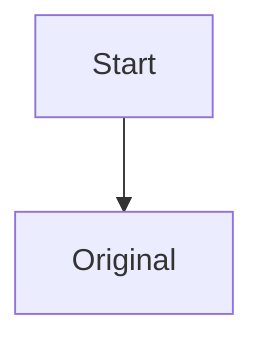

# Editable document

Before $x^2$ after.



<div data-example="embed">Original HTML</div>

$$
a^2+b^2=c^2
$$

- [ ] Finish editing
- [x] Existing task

| Type | Status |
| --- | --- |
| Table cell | Original |

<details open>
<summary>Toggle test</summary>

Editable nested text

</details>

> [!NOTE]
> Editable callout text

- Editable parent

  ```mermaid
  graph TD
    Parent --> Child
  ```

Footnote[^test].

[^test]: Preserved definition


Last paragraph.
